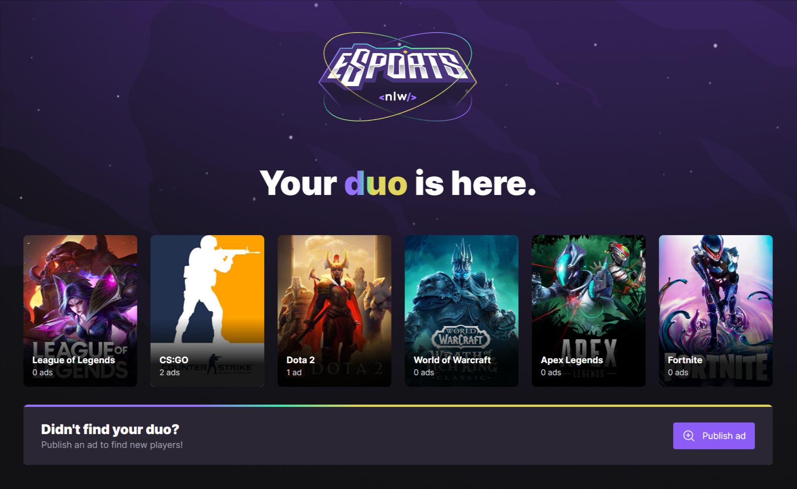
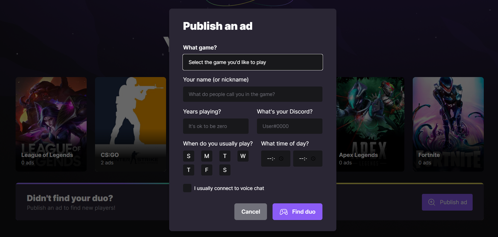

# eSports Web

Platform where gamers can find a partner to play their favorite games together.

Project created during a [Rocketseat](https://www.rocketseat.com.br/) event called NLW eSports. NLW is a week-long intensive coding program focused on developing projects to boost coding skills.

## Table of contents

- [The project](#the-project)
- [Screenshot](#screenshot)
- [Built with](#built-with)
- [Project setup](#project-setup)

## The project

Integration with [eSports Server](https://github.com/leandrodalmolin/esports-server) to list games and publish gamers ads so they can find people to play together.

Users should be able to:

- See list of games with ads counter
- Publish ad to a specific game

## Screenshot




## Built with

- [Vite](https://vitejs.dev/) - Build tool
- [React](https://reactjs.org/) - JS library
- [TypeScript](https://www.typescriptlang.org/) - JavaScript with syntax for types
- [Tailwind CSS](https://tailwindcss.com/) - CSS framework
- [Axios](https://axios-http.com/) - Promise based HTTP client
- [Radix UI](https://www.radix-ui.com/) - Unstyled, accessible components

## Project setup
```
npm install
```

### Start dev server
```
npm run dev
```

### Build for production
```
npm run build
```

### Locally preview production build
```
npm run preview
```